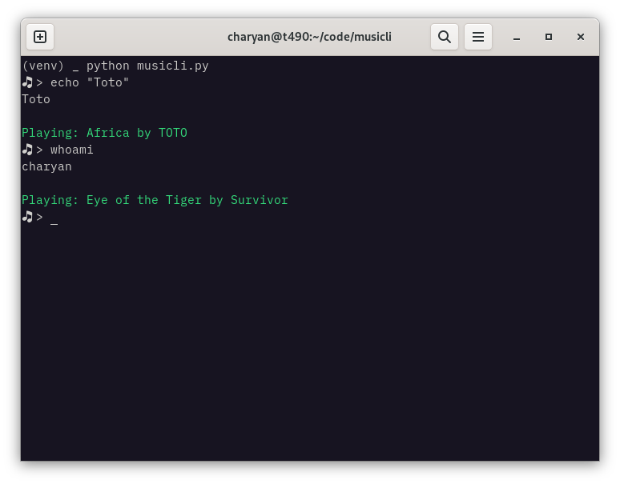

# MusiCLI: Play music on Spotify based on what's happening in your terminal using a local LLM



# How it works

The script give the user input to `subprocess.Popen`. Afterwards, the input, return code and output are sent to the ollama server with a prompt to choose a song. Then, the song name is searched on Spotify through the api and the first result is played on the first available device (if --device-id is not set).

```
usage: musicli.py [-h] [--list-devices] [--device-id DEVICE_ID]

Play music on Spotify based on what's happening in your terminal

options:
  -h, --help            show this help message and exit
  --list-devices        see what devices are connected to the Spotify account
  --device-id DEVICE_ID
                        the device ID to play the song on (optional)
```

# Usage
## Ollama
Install [ollama](https://ollama.ai/)

Pull the model:
```
ollama pull dolphin-mistral
```

Start the ollama server:
```
ollama serve
```

## Spotify
You'll need a [developer account](https://developer.spotify.com/), and to [create an app](https://developer.spotify.com/dashboard/create) with the permissions `Web Playback SDK` and `Web API`.

Add the `client_id`, `client_secret` and `redirect_uri` (for example, `http://127.0.0.1:8088`) for your Spotify app at the top of the script in `musicli.py`.


## MusiCLI
### Setup
```
python -m venv venv
source venv/bin/activate
pip install -r requirements.txt
```

### Run
```
source venv/bin/activate
python musicli.py

```